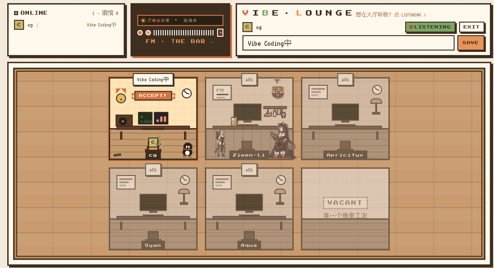
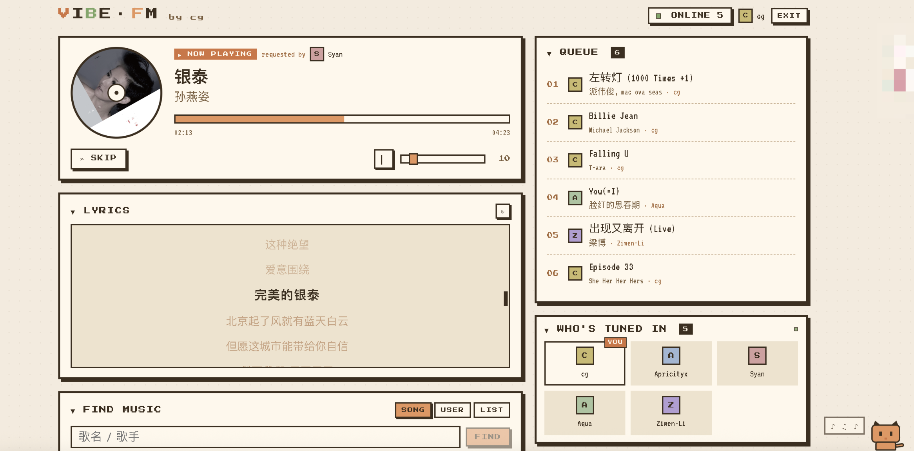

# Vibe FM

一个一键部署、朋友圈级别的 24h Web 电台，音乐源自网易云（用你的 cookie 解析），登录用户可点歌排队。像素风界面，温暖米色调。

在一次升级之后加入了虚拟工位，允许你干活闲着没事的时候看看还有谁也在摸鱼。

一个Vibe Coding的小玩意，效果不错，适合你和朋友闲着没事干的时候一起听听歌、发发牢骚。项目已Docker化，支持一键部署。





## 一、本机开发测试

```bash
cp .env.example .env
# 填 INVITE_CODES、NETEASE_COOKIE、FALLBACK_PLAYLIST_ID

bash run.sh    # 一键起服务，自动等待健康
# 浏览器 http://localhost:8080
```

### 拿 VIP cookie

1. 浏览器登录 music.163.com（建议是 VIP 账号）
2. F12 → Application → Cookies → 把 `MUSIC_U` 那一段复制出来即可（也可以整段复制）
3. 粘到 `.env` 的 `NETEASE_COOKIE`，重启 backend：`docker compose restart backend`

### 兜底歌单

队列空了会随机这里的内容。歌单 URL 末尾的数字就是 ID，例如 `https://music.163.com/#/playlist?id=2829896389` → `2829896389`。

## 二、VPS 部署（一键脚本）

对于不需要备案的海外 VPS，80/443 直接走 Let's Encrypt。

```bash
# 服务器上：
cd /opt # 或者随便什么目录，你开心就好
git clone <你的仓库> vibe-fm
cd vibe-fm
sudo bash deploy-almalinux.sh fm.example.com
# 第一次会停下来让你填 .env，填完再跑一次同样命令
```

在之后，有任何的更新，都可以进到项目的根目录直接用脚本更新。脚本会自动拉代码，然后直接重启当前的docker容器，按理来说不影响任何正在使用的用户。

```bash
bash update.sh
```

脚本做的事：装 docker / 开 firewalld 80,443 / 跑 docker compose（含 Caddy 自动 HTTPS）。

我的VPS是Almalinux，如果你是Ubuntu或者Debian啥的，自己适配一下。

如果是tx云之类的国内云服，都是需要域名备案的，自己折腾一下，或者你可以选择内网部署。

云厂商安全组要单独再放 80/443 入站。其他端口（8000、6379、3000）一律不要暴露——只在 docker 网络内通。

## 三、支持功能

目前支持聊天记录保存最近20条、歌曲搜索使用歌名/歌手名，也可以通过歌单添加想要加入队列的歌曲，搜用户名或者歌单名字都可以。

为了支持海外部署的VPS，我这里挂了一个国内域名伪装，这样不会因为海外IP限制播放各种歌。

另外，意外的发现部署登陆的那个账号，如果有云盘存储的歌曲，也是可以播放的，仅限登录号！

为了节约VPS的流量，如果整个系统里面没有人在听歌，就会自动冻结当前进度，直到下一个人进来。

本来就是Vibe Coding的，想要什么自己加。

## 四、Vibe Lounge：工位 / 留言 / 戳一下

主页 `/` 是 The Floor（工区），点中间的 FM 方框进 `/fm` 听歌。

- **在线状态**：左上 ONLINE 卡片显示谁在线、谁在酒馆里。
- **设个状态**：右上输入框（≤20 字）。带 `☕` / `咖啡` / `续命` 时桌上会出现咖啡；带 `z` / `睡` / `sleep` / `afk` 时会进入"宕机休眠"动画；带 `🎧` / `听歌` 时戴耳机。
- **大厅聊天**：Floor 下面的 LOBBY CHAT，最近 20 条全场可见。
- **工位留言**：点任意工位 → 弹出留言板，每个工位独立保留最近 20 条（140 字）。同一面板里也能 emoji 戳一下。
- **MY WALL**：FM 页右下角原来的 chat 改成自己工位收到的留言，听歌时也能看朋友给你留了啥。

### Claim Your Desk（提 PR 装修自己的工位）

```bash
# 1. 复制模板
cp frontend/src/desks/_template.vue frontend/src/desks/<你的昵称>.vue

# 2. 改造内部 div / SVG / CSS（保持 100% 撑满父容器；像素风 + 米色调）
#    模板里已经把 atDesk / inBar / offline / sleeping / coffee / headphone 钩子写好了

# 3. 在 _layout.json 的 slots 数组里把对应位置改成你的昵称
#    slots 是按行优先的固定槽位（3×2=6 格）

# 4. 提 PR
```

文件名 = nickname（区分大小写）。完整规则见 `frontend/src/desks/README.md`。

## 五、常见问题

- **第一次没声音？** 浏览器自动播放策略会拦首次，页面会出现"CLICK TO PLAY"提示，点一下就好。
- **直链失败 / 403？** VIP cookie 可能过期，更新 `.env` 后 `docker compose restart backend`。
- **想加新邀请码？** 改 `.env` 的 `INVITE_CODES`（逗号分隔），重启 backend。
- **国内想跑？** 需要域名先备案，或改用非标端口（如 8443）+ Caddy DNS-01 证书。脚本默认按海外环境配置。
